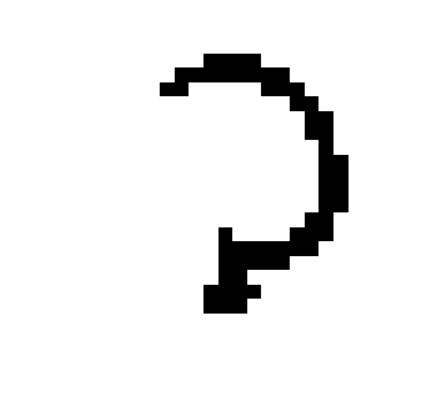

# Handwritten Character Recognition

The aim is to build different kinds of classifiers that seem relevant to predict the class of new examples (for which you don’t 
know the true class) (in terms of accuracy of predictions).

## About the dataset

Examples in this dataset are black and white images representing handwritten characters 
from the arabic alphabet. Below  is  an  example  of  such  an  image

 

- 1700 examples

- 1024 features

- Proportion of examples by label :

| Labels | # of examples  | %      |
|--------|-----------------|-------------|
| 12   | 255       |0.15     |
| 6   | 250       |0.15     |
| 22   | 245       |0.14     |
| 18   | 241       |0.14     |
| 1   | 238       |0.14     |
| 2   | 238       |0.14     |
| 16   | 233       |0.14     |

## Methodology

- Apply the procedure: Train (70%) / Validation (15%) / Test (15%).

- Find the best hyperparameters for each classifier family to maximize the validation accuracy.

- Fit a model with these hyperparameters and estimate the accuracy on unseen data (test).

- Predict new examples (competition set) with the trained model on Kaggle.

## Results

### Raw images

| Classifier  |    | Hyper param.   | Valid. acc. | Test. acc.     | Kaggle acc. |
|---------------|--------|-------------------|-------------|--------------------|-------------|
| Decision tree |    | alpha=0.00084   | 0.573    | 0.518       | 0.517    |
| SVM      | Linear | C=0.01      | 0.710    | 0.714       | 0.635    |
|        | RBF  | C=10, gamma=0.01 | 0.784    | 0.819       | 0.725    |
|        | Poly  | C=10, degree=2  | 0.796    | 0.827       | 0.76    |
| K-NN     |    | k=1        | 0.70    | 0.725       | 0.65    |
| Random forest |    | # of trees=99   | 0.78    | 0.81        | 0.71    |
| Logistic reg. |    | -         | 0.68    | 0.67        | 0.62    |

### HOG representation

The best parameters I've found.
- Image size : 32x32
- Cell size : 4x4
- Block Size : 4x4
- Number of Orientation Bins : 9
- Block Normalization : L2

| Classifier  |    | Hyper param.   | Valid. acc. | Test. acc.     | Kaggle acc. |
|---------------|--------|-------------------|-------------|--------------------|-------------|
| Decision tree |    | -         | -      | -         | -      |
| SVM      | Linear | C=5        | 0.87    | 0.91        | 0.87    |
|        | RBF  | C=5, gamma='scale'| 0.95    | 0.92        | 0.93    |
|        | Poly  | C=5 , degree=2  | 0.94    | 0.95        | 0.94    |
| K-NN     |    | k=11       | 0.89    | 0.91        | 0.88    |
| Random forest |    | # of trees=50   | 0.87    | 0.87        | 0.90    |
| Logistic reg. |    | -         | 0.89    | 0.93        | 0.90    |

## Conclusion
SVM with polynomial (or rbf) kernel is the best classifier based on these scores.

> Note : i did not set the random state in train/validation/test split method.
> It is possible to obtain slightly different results than those of this report when you execute my notebook.
